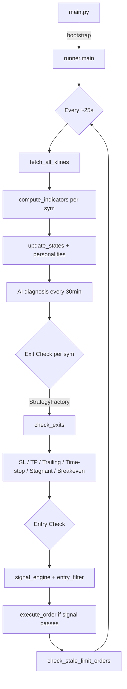
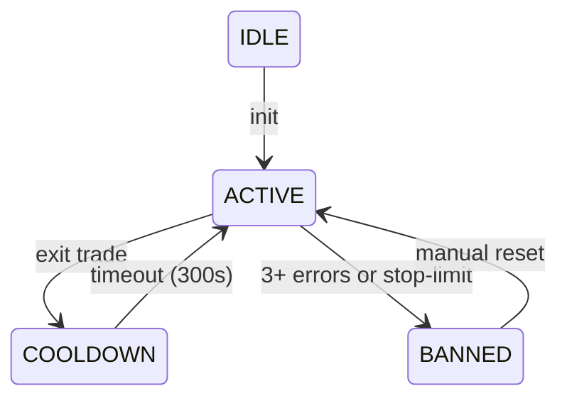
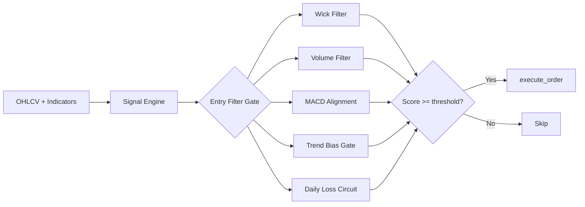
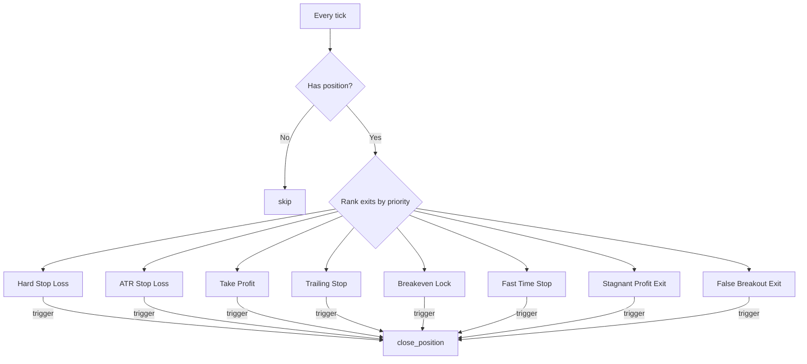

# Binance Bot Architecture

## Directory Layout

```
main.py                  # Entry point (single-instance lock + bootstrap)
├── core/                # Trading engine (all async logic)
│   ├── __init__.py      #   Public API docstring — AI entry point
│   ├── ctx.py           #   Global state: STATES[sym], ALL_SYMBOLS, MARKET_WIND
│   ├── config.py        #   COIN_PROFILE_CONFIG, leverage/risk/timer constants
│   ├── exchange_client.py # ccxt.pro Binance futures client
│   ├── runner.py        #   Main loop orchestrator (~25s tick)
│   ├── market_data.py   #   OHLCV, ATR, SMA, EMA fetching + caching
│   ├── indicators.py    #   EMA, MACD, RSI, ATR, ADX, Bollinger, SL/TP calc
│   ├── check_entries.py #   Entry signal detection (trend, reversal, divergence)
│   ├── entry_filter.py  #   Pre-entry filters (wick, volume, MACD, trend bias)
│   ├── signal_engine.py #   Signal strength scoring, pyramiding, trend bias gate
│   ├── exits.py         #   All exit paths (SL, TP, trailing, time-stop, etc.)
│   ├── orders.py        #   Order execution (paper + real), position mgmt
│   ├── balance.py       #   Balance tracking, daily loss circuit breaker
│   ├── state_manager.py #   Symbol state lifecycle (ACTIVE/COOLDOWN/BANNED)
│   ├── symbol_profile.py#   Per-coin personality config (radar profiles)
│   ├── trade_signal.py  #   Real-time trade flow signal aggregation
│   ├── calc.py          #   Pure calc functions (no ctx dep) — AI: start here
│   └── strategy/        #   Strategy pattern (WIP)
│       ├── base_strategy.py
│       ├── factory.py
│       ├── trend_strategy.py
│       └── momentum_strategy.py
├── services/            # Web API + background services
│   ├── api.py           #   FastAPI server (status, history, radar control)
│   ├── bot_manager_service.py  # Subprocess bot lifecycle
│   ├── paper_trade_service.py  # Manual paper trade operations
│   ├── update_paper_state.py   # paper_state.json read/write with lock
│   ├── ai_manager.py    #   OpenAI GPT-4o diagnostic engine
│   ├── radar_service.py #   ATR-ranking coin radar + auto-switch
│   ├── scanner.py       #   Volume scanner for new coins
│   ├── stream_price.py  #   WebSocket price monitor
│   ├── line_notifier.py #   LINE notify alerts
│   ├── binance_service.py # Price/ticker helpers
│   └── utils.py         #   parse_symbol, paper_key
├── data/                # Runtime state (JSON files)
│   ├── paper_state.json #   Paper trading wallet + positions + trades
│   ├── bot_symbols.json #   Active symbol list + radar profiles
│   ├── atr_history_cache.json # Cached ATR history
│   └── bot_running_state.json # Persisted run flag
├── web/                 # Frontend assets
│   ├── index.html
│   └── templates/
├── config/
│   └── coin_profiles.json
└── tests/
```

## Main Loop Flow (runner.py)



## Pure Calculation Layer (core/calc.py)

`calc.py` contains **pure functions** — take numbers in, return numbers out, no `ctx` or `STATE` dependency.

```
calc.stop_loss_price(avg_price, sl_mult, atr, is_long) → float
calc.take_profit_price(avg_price, tp_mult, atr, is_long) → float
calc.trailing_stop_price(current_price, highest, lowest, ...) → float
calc.profit_pct(current_price, avg_price, is_long) → float
calc.rsi_from_closes(closes) → float
calc.atr_from_ohlcv(ohlcv) → float
calc.signal_strength(rsi, macd_hist, volume_ratio, adx, atr_ratio) → float
```

AI: **If you need to understand or modify a pricing/risk/entry-level rule, check `calc.py` first.** If the logic touches `ctx.STATES` or `s["xxx"]`, it goes in the caller (exits/entries), not in calc.

## Core State Machine (per symbol)



## Entry Pipeline



## Exit Path Decision



## Key Config Patterns (core/config.py)

- `COIN_PROFILE_CONFIG` — per-symbol dictionary with ~20 params (leverage, SL/TP ATR multipliers, min_signal_strength, rr_threshold, etc.)
- 3 profile types: `Core_Trend`, `High_Beta_Momentum`, `Speculative_Risk`
- Dynamic profiles override via `radar_service.py` (ATR-based AI personality)
- `CONFIG_FILE` → `data/bot_symbols.json` (active pool + radar profiles)
- `PAPER_TRADING = True` by default

## Data Files

| File | Purpose | Written By |
|------|---------|-----------|
| `data/paper_state.json` | Wallet balance, positions[], trades[] | `update_paper_state.py` |
| `data/bot_symbols.json` | Active symbols list + radar profiles | `bot_manager_service.py` / `radar_service.py` |
| `data/atr_history_cache.json` | Persisted ATR arrays per symbol | `runner.py` (periodic_status_log) |
| `data/bot_running_state.json` | `{"is_running": bool}` | `bot_manager_service.py` |
